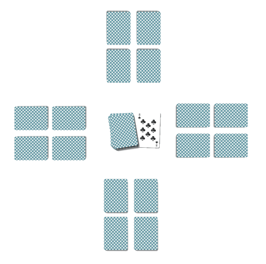

# Cambio[^1]

## The Basics

Cambio is played with **2 or more players**. It's easy to learn and quick to play!

You start by dealing four cards to each player face down in a 2x2 pattern and leaving the deck in the middle.

## Objective

The goal is to have the least amount of points by the end of the game. You may only play the game with one hand. Each player is given **one chance** before the first player picks a card from the deck to view the 2 cards closest to them and memorize them. After that you may not peek again unless you pull a 7 or 8.

The game starts by the first player to the right of the dealer picking a card from the deck. You may swap the card you pull with one of your own. This would be in order to reduce the amount of points you have. 

## Start

**Deal** four cards to each player and face them down in a 2×2 pattern and leave the deck in the middle. 

Each player is given one chance to check out the 2 cards closest to them and memorize them. After that you may not peek again unless you pull a 7 or 8.

*You may only play the game with one hand.*

The game starts by the first player to the right of the dealer picking a card from the deck. You may swap the card you pull with one of your own. This would be in order to reduce the amount of points you have.

## Points

* **Face cards**: 10 points
* **Ace**: 1 point
* **Red king**: -1 points
* **Joker**: 0 points

When you "play" a card, you're laying it face up in the throwaway pile beside the deck. Certain cards have rules when you play them:

## Card Rules

* **7 or 8**: Look at your own card
* **9 or 10**: Look at someone else's card
* **Jack or Queen**: Without looking at the card, you can blind switch one of your own with someone else's.
* **Black King**: You can look at anyone's card and switch anyone's card with any one of yours.

> Scenario: If you pull a 7 card and want to swap it with your 8 that you have face down, you are refusing to play the card and since you can only play the cards you pull, the 8 that you swapped and threw down in the throwaway pile does not count as a "Look at your own."

## Points

When you are playing you can receive an extra penalty card if you:

* Use two hands while playing
* Stick a wrong card

*The extra penalty card is placed face down next to the other player's cards and the player is not allowed to see it when they receive it.*

## Sticking a Card

If a card is placed on the throwaway pile and a player knows one of their cards is the same, they can stick it on top of the matching card so now they have one less card. **Only one player may stick per card** (so be quick!) but any player may stick a card even if it's not their turn. 

If a player knows another player's card and is quick enough to stick that card, the player who stuck it can give one of their own cards to the other player. If you stick a card and are wrong about that card, you have to keep the card in addition to receiving a penalty card. If you attempt to stick another player's card and it's wrong, they keep the card and you still receive the penalty card.

## Winning

In order to win, one player has to call "Cambio"”" during their turn and cannot play a card if they call it. This must be done prior to the next player touching the deck. Once the player calls Cambio, the rest of the players get one more turn to play before everyone flips their cards and adds up their points. The person with the least amount of points wins. If there is a tie, the player who didn't call Cambio wins. If there is a tie between two players who didn't call Cambio, the player with the least value cards wins. (i.e. Joker, Ace and Red King, 2 = Joker, Ace would win)

[^1]: [Original Source](https://cambiocardgame.com/rules/)